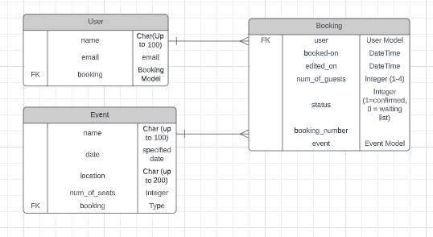
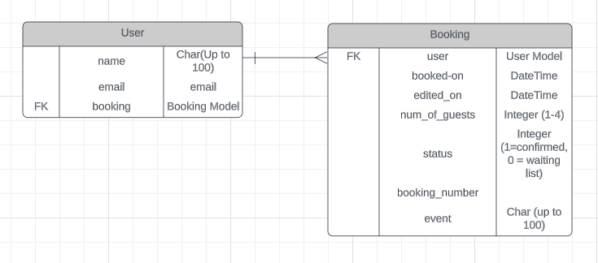

# Pop-up Restaurant

## Purpose

ADD PURPOSE INFO - INTERNAL AND EXTERNAL USER
* The external user goal is to provide a way for people to carry out bookings for a pop-up restaurant event, and allow them to view, edit and cancel those bookings as needed.
* The internal user goal is to provide a way for event staff to view those bookings.
* The site is targeted at the organisers of a pop-up restaurant. It provides a way for them to gather bookings online and to view the information provided by those booking.

ADD LIVE VERSION LINK HERE
* The live version can be accessed here: 

ADD IMAGES ON DIFFERENT SCREEN SIZES. 

## AGILE Methodology

### MILESTONES - EPICS - SPRINTS

* An Agile approach was taken. Possible features were listed and evaluated based on the value they could provide to the user, and their feasibility in terms of time and resources.
* An initial milestone was set on Github for target of minimum functionality.
* Due to the limited time available for completion of the project, only one sprint (5 days) was completed. 
* Work items that were not listed as part of the first sprint, deemed not being crucial for minimum functionality, were moved to a Product Backlog also on Github.
* All items that were part of the completed sprint were converted into User Stories and managed on the Github Kanban board.  
* User Stories that could not be achieved during the sprint were moved back to the Product Backlog, to be evaluated and prioritised before any next sprint begins.

### USER STORIES - ACCEPTANCE CRITERIA - TASKS

* Github Kanban board: User Stories were moved from 'To-do' to 'In Progress' to 'Complete' as work progressed.
* ACCEPTANCE CRITERIA
* TASKS

## UI

*

### Wireframes
### Typography and Color
### Accessibility

INSERT HERE

## Features

ADD CURRENT FEATURES WITH PICTURES

### Future Features

ADD FUTURE FEATURES HERE
* 

## Data Model

### Booking Model
* INSERT INFO HERE
* BOOKING MODEL ATTRIBUTES: INSERT HERE

### OTHER MODEL/CLASS INFO HERE

### Entity Relationship Diagram (ERD)

REMOVE ONE DIAGRAM BELOW
The Models user in this project were mapped out as in the Entity Relationship Diagram below.

## Technology
ADD TECHNOLOGY - CHECK INSTALLED PACKAGES IN REQUIREMENTS
* Heroku was used to deploy the program.
* Gitpod was used for editing.
* Github was used for storing and sharing the repository. 
* LucidChart was used to create the Entity Relationship Diagram (ERD). 
* Bootstrap was used to style the pages.
* ElephantSQL was used to store the database once deployed.
* Cloudinary was used to store static files once deployed.
* Github was used to manage workflow according to Agile principles.

## Testing

### Code Validation
NEED TO COMPLETE
* PYTHON: Code was passed through the [Code Institute Python Linter](https://pep8ci.herokuapp.com/) without any issues.
* HTML: 
* CSS: 

### Other Testing

ADD INFORMATION HERE. INCLUDE SITE AND RESULTS.
* Responsiveness: 
* Cross-browser compatibility: 

### Test Cases
ADD TEST CASE
1. Open the live app. The user is shown a welcome message and club menu. The user notices that they are asked to select a club option.
2. 

### Fixed Bugs
* 

### Remaining Bugs
* 

## Deployment

### Via Gitpod

1. Go to http://github.com.
2. Open the 'SiobhanP1/popup-restaurant' repository.
3. Click on 'Gitpod' to open a Gitpod workspace.
4. Enter the command `python3 manage.py runserver` in the terminal to run the program.

### Via Heroku

The program was deployed using Heroku by doing the following:

1. Go to http://github.com.
2. Open the 'SiobhanP1/tm-club-survey-analysis' repository.
3. Go to https://www.heroku.com.
4. Select 'Create app'.
5. Give the app a unique name.
6. Go to 'Settings'.
7. Click 'Reveal Config Vars'.
8. Under 'key', add 'CREDS'. Under 'value', copy and paste the content of the 'creds.json' in the repository.
9. Go to 'Add Buildpacks'. 
10. Add 'Python' and 'Save Changes'.
11. Add 'NodeJS' and 'Save Changes'.
12. Go to 'Deploy' and then 'Deployment Method'.
13. Select 'Connect to Github'.
14. Enter the repository name.
15. Select 'Manual Deploy'. 
16. Click 'Deploy'.

## Credits

* The template used was created by Code Institute.

