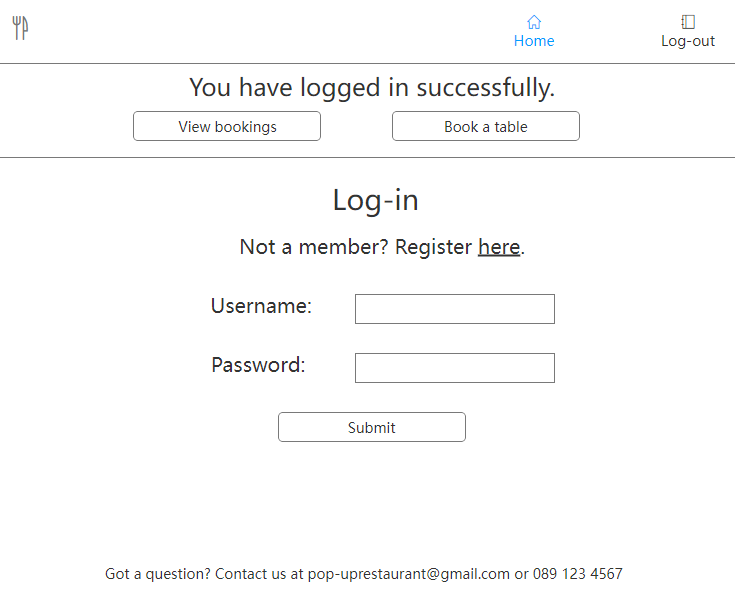

# Pop-up Restaurant

## Purpose

* The external user goal is to provide a way for people to carry out bookings for a pop-up restaurant event, and allow them to view, edit and cancel those bookings as needed.
* The internal user goal is to provide a way for event staff to view those bookings.
* The site is targeted at the organisers of a pop-up restaurant. It provides a way for them to gather bookings online and to view the information provided by those booking.

ADD LIVE VERSION LINK HERE
* The live version can be accessed here: 

## AGILE Methodology

### MILESTONES - EPICS - SPRINTS

* An Agile approach was taken. Possible features were listed and evaluated based on the value they could provide to the user, and their feasibility in terms of time and resources.
* An initial milestone was set on Github for target of minimum functionality.
* Due to the limited time available for completion of the project, only one sprint (5 days) was completed. 
* Work items that were not listed as part of the first sprint, deemed not being crucial for minimum functionality, were moved to a Product Backlog also on Github.
* All items that were part of the completed sprint were converted into User Stories and managed on the Github Kanban board.  
* User Stories that could not be achieved during the sprint were moved back to the Product Backlog, to be evaluated and prioritised before any next sprint begins.

### USER STORIES

* Github Kanban board: User Stories were moved from 'To-do' to 'In Progress' to 'Complete' as work progressed.

## UX

### Wireframes

#### Home Page

#### Log In and Sign up Pages

#### Successful Log In and Registration Alerts

#### Booking Page

#### Successful Booking Alert

#### View Bookings Page

## Features

* Features were added to provide the user with CRUD (Create, Read, Update, Delete) functionality. After logging in, the user can create a booking, read/view it, update it and delete it. 
* The admin user can create, read/view, update and delete bookings and events. 

### Home Page

* The home page displays upcoming event information on cards. 
* Each event appears on a different card and has a 'Book Now' option.  

### Navigation Bar

* The navigation bar is located at the top of every page.
* Logged-out users can see and click on two buttons: 'Home' and 'Log In'.
* Logged-in users can see and click on four buttons: 'Home', 'My Bookings', 'Book a Table', and 'Log Out'.
* 'Home' returns the user to the home page.
* 'My Bookings' brings the user to a list of any bookings they have made.
* 'Book a Table' brings the user to a form where they input information to book a table.
* The navigation buttons collapse into one drop-down button on small screens. 

### Sign In, Log in and Log out

* The sign in, log in and log out pages use the templates provided by Django with a little modification.
* The navigation bar options shown to the user change depending on whether a user is logged-in or logged-out. Users must be authenticated in order to make, view, edit or cancel bookings.
* The sign in and log in form inputs use built-in Django validation to check that the user enters a suitable password and username. 
 
### Home page

* The home page features event information displayed on cards. 
* If a user wishes to book an event, they can click on the 'Book now' button on the event card. If that user is not already logged in, they will be directed to a log in page. 

### My Bookings

* The details of any bookings made by the user are displayed in a list on the page.
* There are two buttons under each booking: 'Edit' and 'Cancel'. 
* Clicking on the 'Edit' button directs the user to the 'Edit booking' form.
* Clicking on 'Cancel' directs the user to the 'Cancel booking' page.

### Book a Table

* The form on the 'Book a Table' page allows the user to book places at one of the pop-up restaurant events.
* The user must be logged in to view this page.
* A drop-down menu allows the user to select the number of guests in their group. 
* Clicking 'Confirm' will bring the user back to the 'My Bookings' page.
* An alert will show if their booking has been successful.

### Edit Booking

* The form on the 'Edit Booking' page allows the user to edit their booking.
* The user can change the number of guests that will attend the event with them.
* When the user clicks 'Submit', they are brought back to the 'My Bookings' page where an alert tells them that their booking has been successfully updated.

### Cancel Booking 

* There is a 'Cancel' button next to each booking listed on the 'My Bookings' page.
* When a user clicks on 'Cancel', they are brought to the 'Cancel Booking' page where they can cancel their booking.
* They are asked if they are sure about cancelling and are given the opportunity to click, 'Cancel' or 'No'.
* After confirming, the user is redirected to the 'My Bookings' page.

### Admin Features

* Admin staff for the restaurant can access the admin dashboard by adding '/admin' to the home page URL. 
* On the dashboard, they have options to create, view, edit, and delete both bookings and events. 
* They can also view, edit, create and delete user information. 

## Future Features

* The Admin User will be able to add the number of seats when they create an event. If a user tries to book seats when there are no longer enough available, they will be added to a waiting list. 
* The details of any event added by the admin user will appear on a card on the home page. Site users will be able to click a 'Book now' link under each of these events.

## Data Model

### Booking Model

* Attributes were added to the Booking model as follows: guest (logged-in user), event (a foreign key connecting a particular booking to a particular event), booked_on (the day and time of booking), last_edited_on (the day and time of the most recent change to the booking), num_of_guests (the number of people who will attend as part of the same booking). 

### Event Model

* Attributes were added to the Event model as follows: event_name (the name of the event instance), created-on (the date the event instance was created by admin), and event_date (the date that the event is to take place).

### Entity Relationship Diagram (ERD)

The Models used in this project were mapped out as in the Entity Relationship Diagram below.

## Views

* All views are class-based, a decision that allowed use of inheritance.

## Templates

* A base template was created to store the navigation bar and footer which appears on each page. All other templates extend this base template.
* The log-in, log-out and sign-up pages use the Allauth templates, with the addition of the navigation bar and footer from the base template.

## Technology

* Heroku was used to deploy the program.
* Gitpod was used for editing.
* Github was used for storing and sharing the repository. 
* LucidChart was used to create the Entity Relationship Diagram (ERD). 
* Bootstrap was used to style the pages.
* ElephantSQL was used to store the database once deployed.
* Cloudinary was used to store static files once deployed.
* Github was used to manage workflow according to Agile principles.
* Mockplus was used to create wireframes.
* Allauth was used for log-in, log-out, and sign-up authentication. 

## Testing

### Code Validation

* Python code was passed through the [Code Institute Python Linter](https://pep8ci.herokuapp.com/). No issues were found.

* HTML code in the template files was validated using the [W3 Validator](https://validator.w3.org/nu/). No errors were found. 

* CSS code was validated using the [W3C CSS Validator](https://jigsaw.w3.org/css-validator/validator).

### Other Testing

* This app was tested for responsiveness using the Google Chrome browser and Chrome DevTools. It has not yet been tested on other browsers.

### Test Cases

#### Test Case 1

1. Open the live app. The user is shown a home page with a large 'Pop-up Restaurant' heading and a card showing the details of an upcoming event. The user notices that there is a 'Book now' button.
2. Click 'Book now'. The user has not logged in so they are directed to a 'Log In' page. The user is not yet registered on the app. The user notices a 'Sign Up' link above the form.
3. Click 'Sign Up'. The user is directed to the Sign Up page. The user notices a form asking for their details.
4. Enter username, email address and password twice. The passwords do not match or do not meet the requirements. The user notices a message appear directing them to re-enter their password.
5. Enter password correctly. The user notices a 'Submit' button beneath the form.
6. Click 'Submit'. The user is directed to a 'My Bookings' page where an alert tells them that they have successfully registered. The user notices that they now have a 'Book a Table' option in the navigation bar.
7. Click 'Book a table'. The user is directed to the booking page. The user notices a form asking for the number of guests. 
8. Enter number of guests. The user notices a 'Submit' button beneath the form.
9. Click 'Submit'. The user is directed to the 'My Bookings' page where an alert tells them that they have successfully booked seats at the event.

### Fixed Bugs

* On smaller screens, the large heading on the home page caused the navigation bar and cards to become small and move to the left. This was fixed by adding a media query for the heading to shrink it on smaller screens.

### Remaining Bugs

* The decision to use class-based views proved challenging and there are a number of issues that I could not provide a solution for within the alloted time.

* The 'event' attribute in the Booking model is a foreign key linking the Booking object to the Event object. I initially added it as a Foreign Key but needed to add a default value and did not succeed in doing so without creating a different error. (I attempted to use the `get_or_create` method to create the default value.) As a result, and until I can fix this bug, the 'event' attribute has the value "Green Square Gardens" and the event name is not editable through the admin dashboard.

* Users must be logged in to access all create, edit, delete and view booking pages, however, it is possible to access other user's booking information by typing in the URL associated with their private pages. I did not yet manage to fix this.  

* It is possible for the same user to book the same event multiple times. 

## Deployment

### Via Gitpod

1. Go to http://github.com.
2. Open the 'SiobhanP1/popup-restaurant' repository.
3. Click on 'Gitpod' to open a Gitpod workspace.
4. Enter the command `python3 manage.py runserver` in the terminal to run the program.

### Via Heroku

The program was deployed using Heroku by doing the following:

1. Go to http://github.com.
2. Open the 'SiobhanP1/popup-restaurant' repository.
3. Go to https://www.heroku.com.
4. Select 'Create app'.
5. Give the app a unique name.
6. Go to 'Settings'.
7. Click 'Reveal Config Vars'.
8. Under 'key', add 'CREDS'. Under 'value', copy and paste the content of the 'creds.json' in the repository.
9. Go to 'Add Buildpacks'. 
10. Add 'Python' and 'Save Changes'.
11. Add 'NodeJS' and 'Save Changes'.
12. Go to 'Deploy' and then 'Deployment Method'.
13. Select 'Connect to Github'.
14. Enter the repository name.
15. Select 'Manual Deploy'. 
16. Click 'Deploy'.

## Credits

* The initial template used to build the project was the ci-full-template provided for project use by Code Institute.

